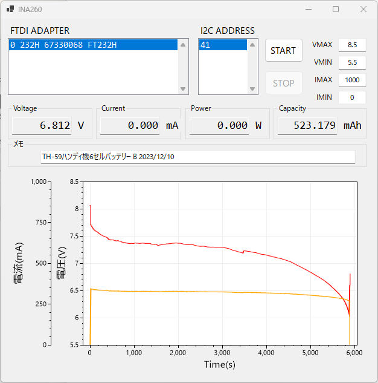

# ina260 電流・電圧グラフ表示サンプル(C#)

## 開発環境

Microsoft Visual Studio Community 2022 (64 ビット)

nuget パッケージは以下2つを使用しています。

* FtdiSharp 0.0.3-alpha
* ScottPlot.WinForms(4.1.69)

## 使用例

個人の blog に当プロジェクトの記事を掲載しました。

https://mkusunoki.net/?p=8180
